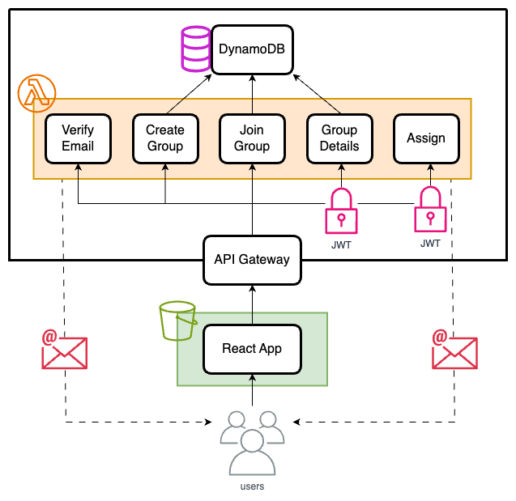

## PairWise (Summer Of Shipping)

### Overview
An app that allows you to randomly generate assignments between group members following a given set of restrictions. It individually emails group members to keep the assignments secret.

### Pairing App Demo

### User Stories
As a user I want to:
* create a group
* join a group

As a group owner I want to:
* view the group members in my group
* add restrictions for who can be paired in my group
* generate assignments
* email the assignment results to group members

### Libraries and Technologies Used
| Technology        | Description                                                                                       | License                                                                                          |
|-------------------|---------------------------------------------------------------------------------------------------|--------------------------------------------------------------------------------------------------|
| Go                | An open-source programming language that makes it easy to build simple, reliable, and efficient software. | [BSD-style license](https://golang.org/LICENSE)                                                |
| AWS Lambda        | Serverless computing service that lets you run code without provisioning or managing servers.     | NA                                                                                               |
| AWS SES           | Amazon Simple Email Service (SES) is a cloud-based email sending service.                          | NA                                                                                               |
| AWS S3            | Amazon Simple Storage Service (S3) is an object storage service for storing and retrieving data.   | NA                                                                                               |
| AWS API Gateway   | Fully managed service for creating, deploying, and managing APIs.                                   | NA                                                                                               |
| AWS CDK           | AWS Cloud Development Kit (CDK) is an open-source software development framework to define cloud infrastructure in code. | [Apache License 2.0](https://www.apache.org/licenses/LICENSE-2.0)                                |
| DynamoDB          | Fully managed NoSQL database service provided by AWS.                                              | NA                                                                                               |
| React             | A JavaScript library for building user interfaces.                                                 | [MIT License](https://opensource.org/licenses/MIT)                                                |
| Vite              | A React build tool.                                                                               | [MIT License](https://opensource.org/licenses/MIT)                                                |
| React Query       | Hooks for fetching, caching, and updating asynchronous data in React.                              | [MIT License](https://opensource.org/licenses/MIT)                                                |
| React Router      | Declarative routing for React applications.                                                        | [MIT License](https://opensource.org/licenses/MIT)                                                |
| Material UI       | React components that implement Google's Material Design.                                          | [MIT License](https://opensource.org/licenses/MIT)                                                |
| TypeScript        | A typed superset of JavaScript that compiles to plain JavaScript.                                  | [Apache License 2.0](https://www.apache.org/licenses/LICENSE-2.0)                                |
